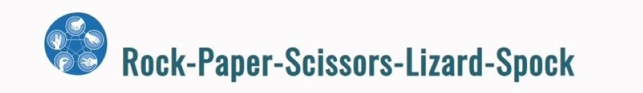
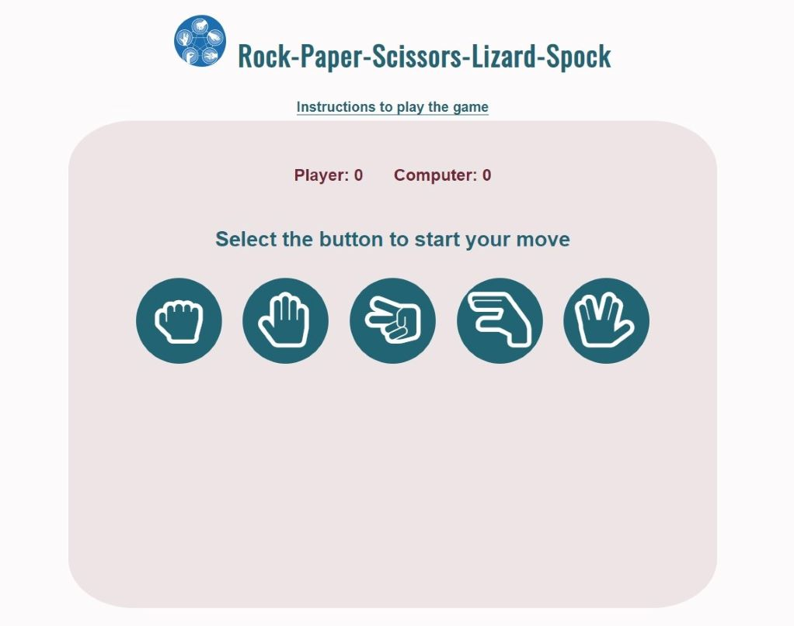
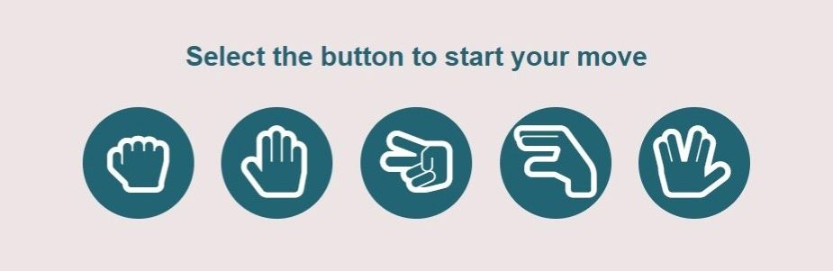
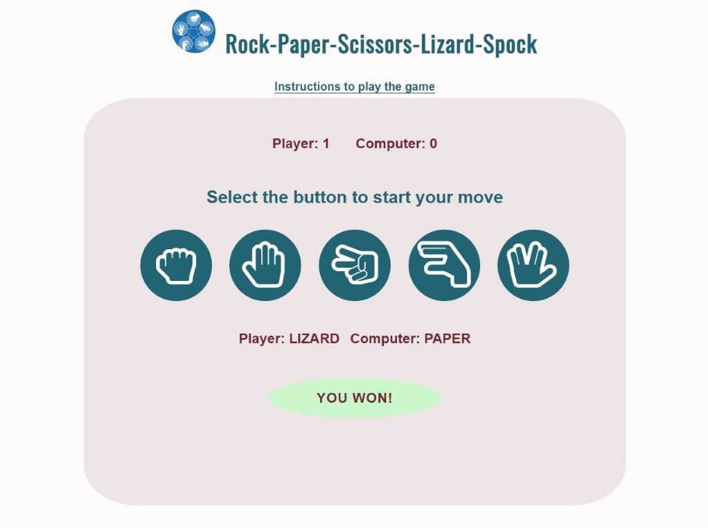
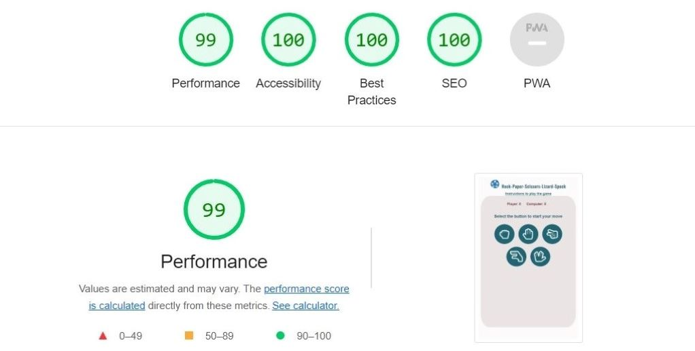

# Rock-Paper-Scissors-Lizard-Spock 
Rock-Paper-Scissors-Lizard-Spock is a game to help players to make decisions with a simple game by selecting their choices and getting a reult based on the computer choices that are truly random. The results of the game are fair than playing with ones hands becuse it has been shown that people familiar with each other are statistically more likely to tie the game.

    

## [View live website](https://humailyas.github.io/Project-2/)

___
# Table of contents
- [UX](#ux)
    - [Website owner goal](#website-owner-goal)
    - [External user goal](#external-user-goal)
    - [Structure of the website](#structure-of-the-website)
    - [Surface](#surface)
- [Features](#features)
    - [Logo and heading](#logo-and-heading)
    - [Navigation bar](#navigation-bar)
    - [Game area](#game-area)
      - [Score area](#score-area)
      - [Choices area](#choices-area)
      - [Result and message](#result-and-message)
      - [Final popup message](final-popup-message)
    - [Instructions](#instructions)
- [Technologies used](#technologies-used)
- [Testing](#testing)
    - [Code validation](#code-validation)
    - [Functionality testing](#functionality-testing)
    - [Compatibility testing](#compatibility-testing)
    - [Performance testing](#performance-testing)
    - [Issues found during site development](#issues-found-during-site-development)
    - [Unfixed bugs](#unfixed-bugs)
- [Deployment](#deployment)
- [Credits](#credits)

___
# UX

## Website owner goal
The main goal of the website owner is:
* To provide a challenging game with increasing levels of difficulty to entertain online players.

## External user goal
The main goal of the website user is:
* To play an online game that has elements of chance.

## Structure of the website
* The design of the website is user-friendy as this is responsive on all type of devices: desktop, laptops, tablets, ipads, and mobiles.
* On all the above mentioned devices players can have a fantastic experience. 
* All parts of the website are designed to achieve maximum player satisfaction.

## Surface

### Colors
Main colours used in the development of Rock-Paper-Scissors-Lizard-Spock:
* font color: #226474; #722635
* background color: #fcfafa; #ece4e5; #226474; white; rgb(203, 246, 203); rgb(245, 192, 192); rgb(208, 205, 205); rgba(239, 200, 200, 0.8)

### Fonts 
* As a main font lato and as a backup font sans-serif are used for the contents of the website.
* As a main font Oswald and as a backup font sans-serif are used for the headings of the website.

### Images
* Images are taken from [Google Images](https://images.google.nl/), which is credited in the [credits](#credits) section.

### Icons
* Icons are taken from [Font Awesome](https://fontawesome.com/), which is credited in the [credits](#credits) section.

[Back to Table of contents](#table-of-contents)

___
# Features

## Logo and heading
* The logo & heading of the rock-paper-scissors-lizard-spock game is featured at the top of the page, which is easy to see by the player. 
* The logo & heading clearly tells the player which game is to play.

    

## Navigation bar
The full responsive navigation bar is featured on the two pages to allow for easy navigation from page to page across all devices.
* Navigation bar is added above the game area to go to instructions page to see the instruction to play the game. 

    

* Navigation bar is added on the instructions page to go back to game area to play the game.

    

## Game area
* This area will allow the player to play the rock-paper-scissors-lizard-spock game. 
* The player will be able to easily see the message to select the icons of rock, paper, scissors, lizard or spock to start the game.

    

### Score area
This area provides the information to player about the scores that how many times the player & computer won the game. 

    

### Choices area
This area will allow the player to select the icons of rock, paper, scissors, lizard or spock to play the game.

    

### Result and message
This area provides the information about the choices made by player & computer, as well as the result of the current attempt to show either player or computer won or it's a tie.

    

### Final popup message 
* The final popup message appears after limited number of attempts before the game is over. 
* The final popup message shows either you or computer won with 20 scores.

     

## Instructions
This page provides the instructions to play the game.

     

[Back to Table of contents](#table-of-contents)

___
# Technologies used

Different technologies were used to complete the contents of Rock-Paper-Scissors-Lizard-Spock website.

### GitHub
* As a software hosting platform to keep project in a remote location.

### Git
* As a version-control system tracking.

### Gitpod  
* As a development hosting platform.

### HTML5
* As a structure language.

### CSS
* As a style language.

### JavaScript
* As an interactivity langauage.

### Font Awesome
* As an icon library for icons used in the choices area for rock, paper, scissors, lizard & spock.

[Back to Table of contents](#table-of-contents)

___
# Testing

## Code validation
Rock-Paper-Scissors-Lizard-Spock is validated for a code using three websites.

### HTML
* No errors were found when passing through the official [W3C HTML Validator](https://validator.w3.org/)

### CSS
* No errors were found when passing through the official [W3C CSS Validator (Jigsaw)](https://jigsaw.w3.org/css-validator/)

### JavaScript
* No errors were found when passing through the official [JSHint JavaScript Validator](https://jshint.com/)
 
## Functionality testing
Chrome developer tools were used throughout the project for testing and solving problems with responsiveness and style issues.
 
## Compatibility testing
The website was tested across multiple virtual mobile devices and browsers.

## Performance testing
[Lighthouse](https://developers.google.com/web/tools/lighthouse/) tool was used to check the performance of the website.
* A couple of changes were made to improve the performance.

### Final results
* The colors and fonts chosen are easy to read and accessible on desktop.

    

* The colors and fonts chosen are easy to read and accessible on mobile.

    

## Issues found during site development

### Horizontal and vertical scroll bars
* Horizontal & vertical scroll bars appeared on the screen. 
I adjusted this issue:
   * By adding a code "overflow: hidden" in the body.

## Unfixed bugs
* No unfixed bugs

[Back to Table of contents](#table-of-contents)

___
# Deployment

The website was deployed on GitHub pages. Gitpod was used as a development environment where all the changes were committed to git version control system. The push command was used in Gitpod to save changes into GitHub.

The following steps were taken to deploy the website:
* Open the GitHub repository, navigate to the Settings tab
* From the source section, select the Main Branch
* Click save and page was deployed after auto-refresh to indicate the successful deployment

## [View live website](https://humailyas.github.io/Project-2/)

[Back to Table of contents](#table-of-contents)

___
# Credits

To complete the contents of Rock-Paper-Scissors-Lizard-Spock website, I learned coding and collected the information from different sources.
* Learned HTML, CSS & JavaScript coding from [Code Institute](https://learn.codeinstitute.net/)
* Used Code Institute student template [gitpod full template](https://github.com/Code-Institute-Org/gitpod-full-template)
* Collected information on good and bad coding practices from:
  * [Write Best Code](https://learn.shayhowe.com/html-css/writing-your-best-code/)
  * [HTML & CSS Coding Best Practices](https://medium.com/@inceptiondj.info/html-css-coding-best-practice-fadb9870a00f)

## Content
* The information about the game conditions was taken from [Big Bang](https://bigbangtheory.fandom.com/wiki/Rock,_Paper,_Scissors,_Lizard,_Spock)
* The icons used in the choices area for rock, paper, scissors, lizard & spock were taken from [Font Awesome](https://fontawesome.com/)
* The code to make the game conditions was taken from [Rock-Paper-Scissors-Lizard-Spock Project](https://github.com/partha7978/Rock-Paper-Scissors-Lizard-Spock)

## Media
* The image used as a Logo was taken from [Google Images](https://images.google.nl/)

[Back to Table of contents](#table-of-contents)
